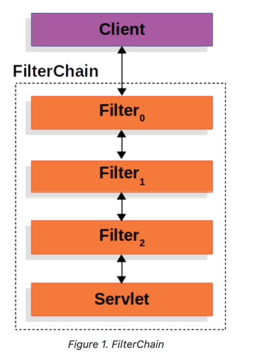
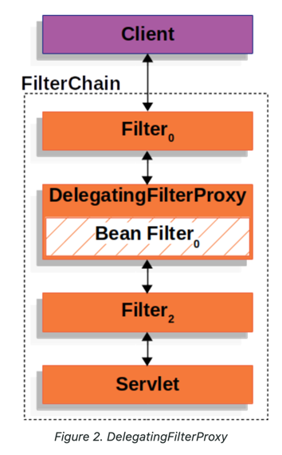
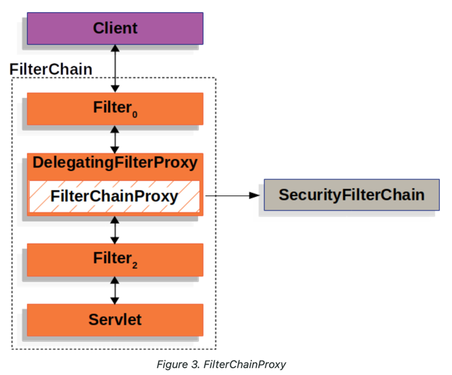
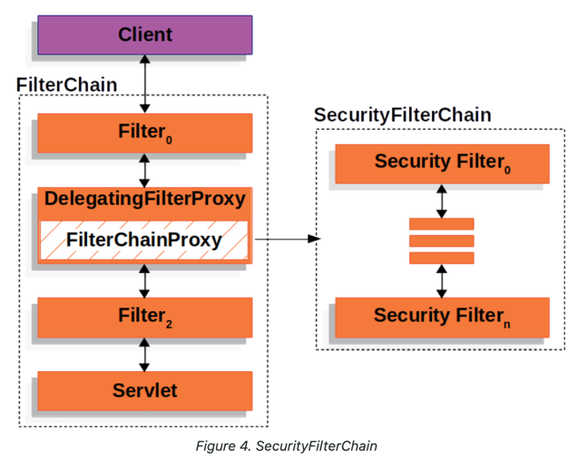
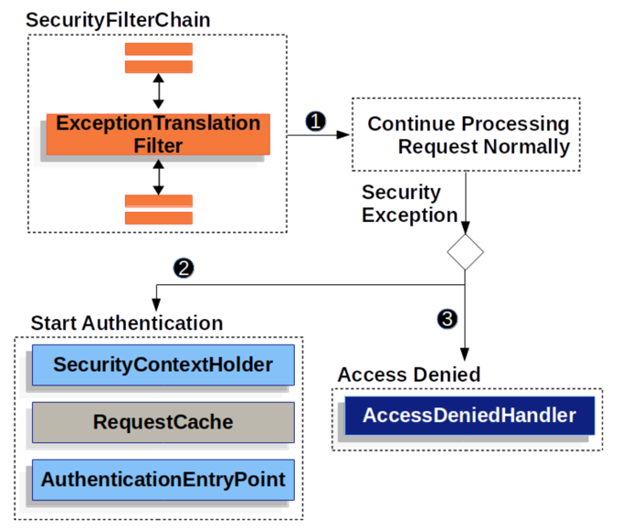

# spring-security-study
spring-security-study

## Overview
Spring Security is a framework that provides authentication, authorization, and
protection against common attacks.

---

## Prerequisites
Spring Security requires a Java 17 or higher Runtime Environment.

Spring Security는 일반적으로 애플리케이션 코드 내에서 설정하고 동작하기 때문에, 
JRE에 별도의 외부 보안 설정 파일을 배포할 필요가 없습니다.

---

## Architecture
### Filter
Spring Security는 Servlet Filter에 기반한다.


#### flow
Client → Http Request → FilterChain → DispatcherServlet → Handler (Controller)

Client가 Http request를 application에 요청을 보냅니다.
Servlet Container(ex,Tomcat)가 요청을 받으면 FilterChain을 생성하고, 해당 요청 URI 경로에 맞는 Filter과 Servlet를 연결합니다.
FilterChain은 요청이 필터들을 순서대로 거치도록 합니다.


하나의 HttpServletRequest와 HttpServletResponse는 최대 한 개의 Servlet에 의해 최종적으로 처리되지만, 그 전에 여러 개의 Filter가 요청을 처리하거나 검증할 수 있습니다.  

현재 Filter에서 요청을 확인한 후, 조건에 따라 다음 Filter(Downstream)나 Servlet로 요청을 차단할 수 있습니다.
예를 들어 사용자가 인증되지 않았다면, 다음 Filter로 넘기지 않고, 현재 위치에서 HttpServeletResponse에 직접 error response를 할 수 있습니다.

현재 Filter은 HttpServletRequest, HttpServletResponse를 수정할 수 있고, 수정된 요청이나 응답은
Downstream Filter, Servlet에서 사용할 수 있습니다.

- ex) 요청에 사용자 인증 정보 추가, 응답 헤더에 보안 정보 삽입

---

### DelegatingFilterProxy
Filter의 구현체로 Servlet Container와 Application Context 사이를 연결하는 역할을 합니다.
Servlet Container는 Filter 인스턴스를 등록하고 관리하지만, Spring ApplicationContext에 접근할 수 없습니다.
따라서 Servlet Container에서 관리하는 Filter는 Spring bean(AuthenticationManager, UserDetailsService)을 사용할 수 없습니다.
   
그래서 이를 연결해주는 DelegatingFilterProxy가 필요합니다. DelegatingFilterProxy는 Servlet Container에 Filter로 등록지먄, 실제로는 
Spring ApplicationContext에 정의된 Spring Bean에게 위임하는 작업을 합니다.

##### key
`Servlet Container(Tomcat)와 Spring의 ApplicationContext가 서로 다른 관리 영역에 있기 때문에, 이를 연결해줄 DelegatingFilterProxy가 필요합니다.`
        
#### flow
Servlet Container가 요청을 받으면 DelegatingFilterProxy가 요청을 가장 먼저 받습니다.
이후 Spring ApplicationContext에서 찾은 실제 Filter Bean에게 작업을 넘겨서 처리하도록 합니다.




추가적으로 DelegatingFilterProxy는 애플리케이션 시작 시점에 등록되지만, 
실제 Filter Bean은 Lazy InitialZation으로 동작합니다.

---

### FilterChainProxy
DelegatingFilterProxy를 통해 받은 요청과 응답을 스프링 시큐리티 필터 체인에 전달하고, 작업을 위임합니다.
Spring Security가 제공하는 특수한 필터로 여러 개의 Security Filter를 관리하고 실행합니다. 
SecurityFilterChain을 통해 요청 경로에 맞는 필터들을 순차적으로 실행합니다.

FilterChainProxy는 Spring Bean으로 등록되고, DelegatingFilterProxy에 의해
Servlet Container의 필터로 동작합니다.

중간에 FilterChainProxy를 두는 이유는 Spring Security의 모든 Servlet 지원이 이 필터에서 시작되기 때문입니다. 
만약, 서블릿에서 문제가 발생한다면 FilterChainProxy에서 파악할 수 있습니다.


#### flow

- Client -> request -> Servlet Container -> DelegatingFilterProxy

- DelegatingFilterProxy -> Spring ApplicationContext의 FilterChainProxy 호출

- FilterChainProxy -> SecurityFilterChain을 통해 Security Filter 실행


  



---

### SecurityFilterChain
여러 개의 Security filter의 집합   

Spring Security에 요청이 들어왔을 때, 어떤 필터들이 실행될지 정의된 체인입니다.
각 요청 경로에 따라 필터 목록이 다를 수 있습니다.




---

### Security Filters
SecurityFilterChain에 포함된 개별 필터로, 인증, 권한 검증, CSRF 보호 등 다양한 보안 작업을 처리합니다.


#### 필터 체인에 Custom Filter 추가
- addFilterBefore(Filter, Class<?>)	: 지정한 필터 전에 Custom Filter를 추가합니다.
- addFilterAfter(Filter, Class<?>)	: 지정한 필터 후에 Custom Filter를 추가합니다.
- addFilterAt(Filter, Class<?>)	: 지정한 필터 위치에서 교체합니다. 기존 필터를 Custom Filter로 대체합니다.


####  Custom Filter 위치 선정 (Rule of Thumb)

Custom Filter의 위치는 어떤 Security 이벤트 발생 후에 실행될지에 따라 결정합니다.
- Authentication Filter의 경우 보안 설정 완료 후
- Authorization Filter의 경우 사용자 인증 완료 후 (Security Context에 인증 정보가 있는 상태)


---
  
If you create a Filter:  
1. Implement the Filter interface
2. Extend the OncePerRequestFilter class (which ensures that the filter 
   is invoked once per request)
   

And then you need to add the filter to the SecurityFilterChain
```java
@Bean
SecurityFilterChain filterChain(HttpSecurity http) throws Exception {
    http
        // ...
        .addFilterAfter(new TenantFilter(), AnonymousAuthenticationFilter.class);
    return http.build();
}
```

---

#### 필터를 Spring Bean인 경우
중복 호출 문제가 발생할 수 있어 FilterRegistrationBean을 사용해 Spring Boot의 자동
등록을 비활성화 해야 합니다.

---

### Handling Security Exceptions
애플리케이션 실행 중 인증 실패, 권한에서 예외가 발생할 수 있다. 
예외 발생 시 사용자에게 알맞은 HTTP 응답을 보내야 하는데, 이 과정을 
Spring Security에서 ExceptionTranslationFilter이 처리한다.  
   
AuthenticationFilter, AuthorizationFilter 다음에 위치하고, 예외가 발생할 때 호출된다.  

`[ UsernamePasswordAuthenticationFilter → AuthorizationFilter → ExceptionTranslationFilter ]`
   

  
1. 먼전 FilterChain.doFilter(request, response)를 호출하여 필터를 실행합니다. 
2. 인증 실패(AuthenticationException) -> SecurityContext를 초기화 -> 현재 HTTP 요청 저장 -> 인증 정보 요청
3. 권한 거부(AccessDeniedException) -> AccessDeniedException이 발생하면, 접근을 거부한다.

   
##### pseudocode for ExceptionTranslationFilter
```java
try {
	filterChain.doFilter(request, response);
} catch (AccessDeniedException | AuthenticationException ex) {
	if (!authenticated || ex instanceof AuthenticationException) {
		startAuthentication();
	} else {
		accessDenied();
	}
}
```


---

